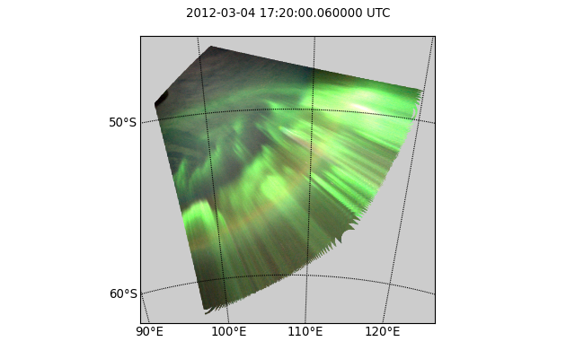
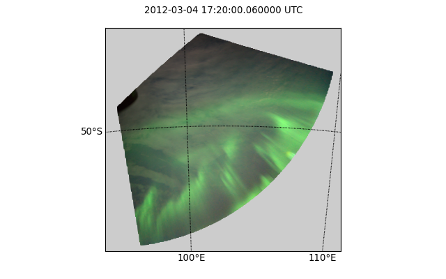
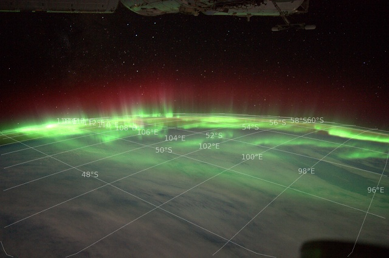
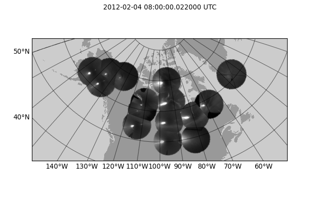
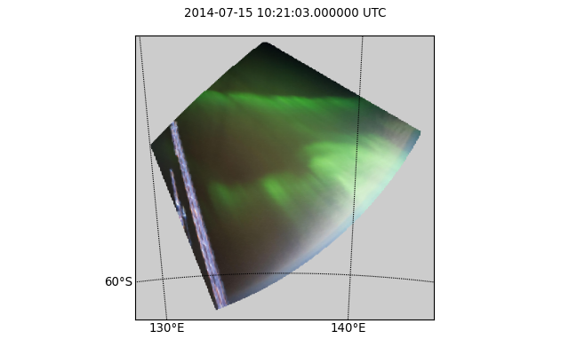
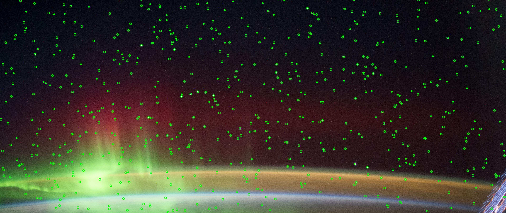
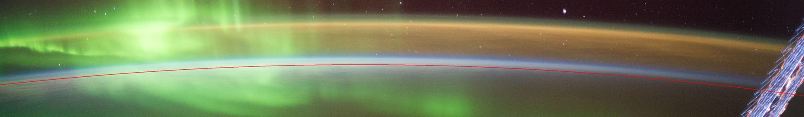
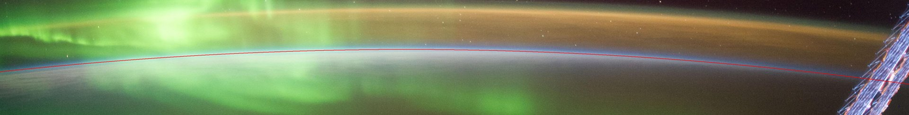
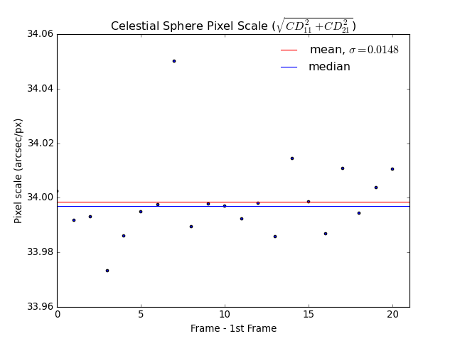
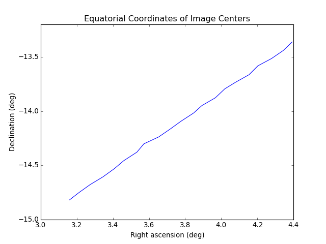

User Guide
==========

Installation
------------

Please follow the instructions on the `PyPI page <http://pypi.python.org/pypi/auromat>`_.

If there are any issues not mentioned there please 
`contact us <http://www.cosmos.esa.int/web/arrrgh/contact>`_.

Usage of command-line tools
---------------------------

.. highlight:: bash

If you intend to use AUROMAT only for downloading data from an
online archive and possibly converting the data to 
`CDF <http://cdf.gsfc.nasa.gov>`_ or 
`netCDF <http://www.unidata.ucar.edu/software/netcdf/>`_ format, 
then the supplied command-line tools should provide sufficient
functionality without delving into how to use the software within Python.

The following examples show how to download and convert data from the
ESA ISS archive.

First, we download the georeferenced image data for a given image sequence ID
with the :mod:`auromat-download <auromat.cli.download>` tool.
Here we use `sequence 51 <https://arrrgh-tools.cosmos.esa.int/sequence/77>`_::

	$ mkdir /data/iss
	$ cd /data/iss
	$ auromat-download esa-iss --id 77
	downloading https://.../api/georef_seqs/77-> done
	downloading https://.../api/georef_seqs/77/metadata.json-> done
	downloading https://.../data/bad_pixels/ISS030-E/122500/ISS030-E_26_badpixels.gz-> done
	downloading https://.../data/img/ISS030-E/122500/ISS030-E-122539.nef-> done
	downloading https://.../data/wcs/ISS030-E/122500/ISS030-E-122539_25738.wcs-> done
	...
	downloading https://.../data/img/ISS030-E/123000/ISS030-E-123010.nef-> done
	downloading https://.../data/wcs/ISS030-E/123000/ISS030-E-123010_26209.wcs-> done
	Done.

Let's see what and how much was downloaded::

	$ ls
	seq-77
	
	$ ls -l seq-77
	-rw-r--r--+ 1 user user   198632 Dec  1 14:39 api.json
	-rw-r--r--+ 1 user user    81919 Dec  1 14:39 bad_pixels.gz
	-rw-r--r--+ 1 user user 10659774 Dec  1 14:40 ISS030-E-122539.nef
	-rw-r--r--+ 1 user user     2880 Dec  1 14:40 ISS030-E-122539.wcs
	...
	-rw-r--r--+ 1 user user    26905 Dec  1 14:39 metadata.json
		
	$ du -h seq-77
	4.8G	seq-77
	
The ``.nef`` files are the original RAW camera files while the ``.wcs`` files
contain the metadata necessary for georeferencing them. 

Now, we convert the downloaded data into a standard format that is easy to work with
by using the :mod:`auromat-convert <auromat.cli.convert>` tool::
	
	$ auromat-convert --data seq-77 --format cdf
	
Note that this will take a while depending on how many frames the sequence
contains. This is because the actual dataset is computed from the metadata first.

The resulting files are by default stored in the ``converted/`` subfolder::

	$ ls -l seq-77/converted
	-rw-r--r--+ 1 user user 373829959 Dec  1 16:01 ISS030-E-122539.cdf
	...
	
	$ du -h seq-77/converted
	172.3G	seq-77/converted

There are many options available in the :mod:`auromat-convert <auromat.cli.convert>` tool.
A description can be shown by calling it without any options.

Common use-cases may be to exclude geographic coordinates (and only store
MLat/MLT coordinates) and pixel corner coordinates (and only store pixel center
coordinates)::

	$ auromat-convert --data seq-77 --format cdf --without-geo --without-bounds

	$ du -h seq-77/converted
	63.1G	seq-77/converted

The resulting data files are self-contained and should contain all necessary
metadata to be able to work with them.

Introduction to Python API
--------------------------

.. highlight:: python

Currently, the command-line tools offer only a limited subset of AUROMAT's
functionality. For example, visualizing data or georeferencing own images
requires to use the Python API.
The following provides a very short introduction to it. For further
information, please consult the `API documentation <api/auromat>`_.

The examples below can be directly run in a Python shell.

Use case: Visualizing downloaded data
~~~~~~~~~~~~~~~~~~~~~~~~~~~~~~~~~~~~~

We assume that an image sequence from the ESA ISS archive was already downloaded
with the :mod:`auromat-download <auromat.cli.download>` tool as shown above.
Now we use the Python API to visualize the georeferenced images.

First, we define on which dataset and mapping altitude we want to work and
how the RAW images shall be postprocessed:

>>> from auromat.mapping.iss import ISSMappingProvider
>>> provider = ISSMappingProvider('/data/iss/seq-77', altitude=110, raw_auto_bright=True, raw_gamma=None)
>>> provider.range
(datetime.datetime(2012, 3, 4, 17, 18, 54), datetime.datetime(2012, 3, 4, 17, 26, 45))

Now, we request a single image out of the set and let AUROMAT georeference it
using the altitude that was defined earlier:

>>> from datetime import datetime
>>> mapping = provider.get(datetime(2012, 3, 4, 17, 20, 0))
>>> mapping.metadata['mission'], mapping.metadata['frame']
(u'ISS030', 122605)
>>> mapping.boundingBox
BoundingBox(latSouth=-62.190843, lonWest=95.411578, latNorth=-45.961958, lonEast=120.28385)
>>> mapping.arcSecPerPx.width
PixelScale(mean=7.9593521008, median=6.1537259006, min=4.0048511309, max=156.57782882)

To visualize the georeferenced image on a map we have to downsample it first, otherwise
matplotlib would be overwhelmed by the number of polygons to draw:

>>> from auromat.resample import resample
>>> resampled = resample(mapping, arcsecPerPx=100)
>>> resampled.arcSecPerPx.width
PixelScale(mean=102.525998960, median=103.801386204, min=81.2014140, max=119.10222026)
>>> resampled.arcSecPerPx.height
PixelScale(mean=100.093068376, median=100.088951928, min=100.0108325, max=100.18487082)

Note that resampling is always done on a plate carree projection. For this reason,
the resulting pixel scale can only come *close* to the requested one. Only the mapping
center has exactly the requested pixel scale.

Now, let's draw a simple stereographic map and save it as PNG file:

>>> import auromat.draw as draw
>>> from auromat.draw import saveFig
>>> saveFig('map.png', draw.drawStereographic(resampled))

The circular holes in the image are caused by the resampling algorithm, which by default
is a straight-forward rebinning. The scale of the nonresampled pixels near the horizon
is very high, meaning that only few data points exist which for rebinning means
that holes will appear when no data points for the target pixel exists.
By using a different resampling method, this effect can be prevented:

>>> resampled = resample(mapping, arcsecPerPx=100, method='nearest')
>>> saveFig('map.png', draw.drawStereographic(resampled))

However, non-default resampling methods like the one above should in general
not be used as they either interpolate or extrapolate values.
As the areas near the horizon are not that scientifically useful anyway
(due to the low elevation angle and resulting perspective error) a better
method is to mask the mapping by a given minimum elevation:

>>> resampled = resample(mapping, arcsecPerPx=100)
>>> masked = resampled.maskedByElevation(10)
>>> saveFig('map.png', draw.drawStereographic(masked))

Another way to visualize mappings is to draw the coordinate grid on top of
the original image:

>>> saveFig('map.png', draw.drawParallelsAndMeridians(mapping))

Note that the line artifacts near the border are caused by how the grid lines
are created (by resampling the mapping).

Let's check if THEMIS has data at the same time:

>>> from auromat.mapping.themis import ThemisMappingProvider
>>> themis = ThemisMappingProvider('/data/themis/L1', '/data/themis/L2')
>>> mapping2 = themis.get(datetime(2012, 3, 4, 17, 20, 0))
ValueError: No THEMIS mappings found at 2012-03-04 17:20:00 +- 2s

Let's check a different time instead for demonstration purposes:

>>> mapping2 = themis.get(datetime(2012, 2, 4, 8, 0, 0))
>>> len(mapping2)
15
>>> mapping2.mappings[0].boundingBox
BoundingBox(latSouth=44.7575699, lonWest=-130.708014, latNorth=64.7592500, lonEast=-95.706808)

The THEMIS mapping provider always returns collections of mappings, as THEMIS operates
multiple cameras. The drawing methods can handle these as well, and as the THEMIS resolution
is not that high, we do not need to resample them:

>>> mapping2 = mapping2.maskedByElevation(10)
>>> saveFig('map.png', draw.drawStereographic(mapping2))

To see the full list of drawing methods, please see
the :mod:`auromat.draw` API docs.

Use case: Georeferencing astronaut photography
~~~~~~~~~~~~~~~~~~~~~~~~~~~~~~~~~~~~~~~~~~~~~~

We are going to georeference frames 
`ISS040-E-64750 <http://eol.jsc.nasa.gov/SearchPhotos/photo.pl?mission=ISS040&roll=E&frame=64750>`_ to
`ISS040-E-64770 <http://eol.jsc.nasa.gov/SearchPhotos/photo.pl?mission=ISS040&roll=E&frame=64770>`_
from NASA's astronaut photography website.

.. image:: http://eol.jsc.nasa.gov/DatabaseImages/ESC/small/ISS040/ISS040-E-64760.JPG

These image were taken 15 July 2014.
For simplicity's sake we will use the 
`JPEG versions <http://eol.jsc.nasa.gov/DatabaseImages/ESC/large/ISS040/ISS040-E-64770.JPG>`_ 
, but similar steps apply to RAW images.

First, we download the frames:

>>> from auromat.solving.eol import downloadImageSequence
>>> imgfolder = '/data/iss_imgs'
>>> metadata, failures = downloadImageSequence(imgfolder, 'ISS040', 64750, 64770, 'jpg')
downloading sequence frames 64750 to 64770 of ISS040-E
downloading http://eol.jsc.nasa.gov/DatabaseImages/ESC/large/ISS040/ISS040-E-64750.JPG-> done
...
downloading http://eol.jsc.nasa.gov/DatabaseImages/ESC/large/ISS040/ISS040-E-64770.JPG-> done
>>> failures
[]

Then, we correct the lens distortion:

>>> from auromat.solving.eol import correctLensDistortion
>>> dcfolder = '/data/iss_imgs_dc'
>>> correctLensDistortion(imgfolder, dcfolder)
NOTE: Using lensfun lens "Nikkor 50mm f/1.4D AF" with score 100 (EXIF: "AF Nikkor 50mm f/1.4D")

Now we determine the astrometric solution 
of each frame. This is done by automatically masking the starfield (see :mod:`auromat.solving.masking` module)
in the image and then using the `astrometry.net <http://astrometry.net>`_ software:

>>> from auromat.solving.spacecraft import solveSequence
>>> wcsfolder = '/data/iss_wcs'
>>> stuser, stpass = 'space-track-user', 'space-track-pass'
>>> noradid = 25544 # NORAD ID of ISS
>>> tlefolder = '/data/tles' # location where orbit data from space-track.org is cached
>>> paths = list(solveSequence(dcfolder, wcsfolder, tlefolder, stuser, stpass, noradiss))
>>> len(paths) == 21
True

The `space-track.org <https://www.space-track.org>`_ login credentials are
necessary to determine the ISS location at the time the image was taken. This information
is stored in the resulting WCS header files and later used for georeferencing.

The returned ``paths`` list contains an ``imagepath, wcspath`` tuple for each successfully
solved image. In this case, all images of the sequence were solved.

We are now able to visualize the georeferenced images with stereographic maps:

>>> from auromat.mapping.spacecraft import SpacecraftMappingProvider
>>> from auromat.resample import resample
>>> from auromat.draw import saveFig
>>> import auromat.draw as draw
>>> provider = SpacecraftMappingProvider(dcfolder, wcsfolder)
>>> provider.range
(datetime.datetime(2014, 7, 15, 10, 21, 3), datetime.datetime(2014, 7, 15, 10, 21, 43, 60000))
>>> mapping = provider.getById('64750') # id = any unique part of the filename
>>> resampled = resample(mapping, arcsecPerPx=100)
>>> masked = resampled.maskedByElevation(10)
>>> saveFig('map.png', draw.drawStereographic(masked))

To judge how accurate the obtained astrometric solution is, we can 
overlay reference stars onto the original image:

>>> saveFig('astrometry.jpg', draw.drawReferenceStars(mapping, scale=2))

(`big version <../_static/astrometry.jpg>`_)

It can be clearly seen that the astrometry is very accurate, given the limits of
the images themselves, having small star trails due to the movement of the ISS.

Another tool for checking the accuracy is to 
plot the earth horizon:

>>> saveFig('horizon.png', draw.drawHorizon(mapping, color='red'))

Due to the clouds it is not easy to judge the accuracy. By assuming a cloud height
of 12km the picture gets clearer:

>>> provider = SpacecraftMappingProvider(dcfolder, wcsfolder, altitude=12)
>>> mapping = provider.getById('64750')
>>> saveFig('horizon.png', draw.drawHorizon(mapping, color='red', useMappingAltitude=True))

There are cases when the horizon is drastically shifted downwards or upwards relative to the
real horizon. This is caused by inaccurate image timestamps. Using references in the images
such as the horizon (but also city lights) the timestamps can be adjusted. For doing that,
see the ``timeshift`` parameter of :class:`~auromat.mapping.spacecraft.SpacecraftMappingProvider`
and the ``drawCities`` parameter of :func:`~auromat.draw.drawStereographic`.

As repeating these steps for each image would require quite some effort, it is
often helpful to instead plot certain variables for the whole sequence or create movies.
For example, to get a first idea of how stable the astrometric solutions are,
we can plot the resulting celestial pixel scales, rotation angles, and 
coordinates of the image center:

>>> saveFig('pxscales.png', draw.drawAstrometryPixelScales(provider.getSequence()))
>>> saveFig('rotation.png', draw.drawAstrometryRotationAngles(provider.getSequence()))
>>> saveFig('radec.png', draw.drawRaDec(provider.getSequence()))

.. image:: ../_static/rotation.png

In this example, the variation is very little which suggests a stable astrometry over the
whole sequence.

Movies can be easily created from any type of plot, map, etc. The first step
is always to create and store the desired movie frames in the right order:

>>> import os
>>> from auromat.mapping.mapping import BoundingBox, MaskByElevationProvider
>>> from auromat.resample import ResampleProvider
>>> first,last = provider.range
>>> masked = MaskByElevationProvider(provider, 10)
>>> boundingboxes = [masked.get(first).boundingBox, masked.get(last).boundingBox]
>>> bb = BoundingBox.mergedBoundingBoxes(boundingboxes)
>>> resampled = ResampleProvider(masked, arcsecPerPx=100)
>>> moviefolder = '/data/iss_movie'
>>> os.mkdir(moviefolder)
>>> mappaths = []
>>> for m in resampled.getSequence():
...   mappaths.append(os.path.join(moviefolder, m.identifier + '.png'))
...   saveFig(mappaths[-1], draw.drawStereographic(m, boundingBox=bb))

What happened is the following: First, we determined a bounding box
that spans the whole image sequence. This constant bounding box was then
used for creating the map images. Note that masking and resampling was done
in a slightly different way here. Instead of manually masking and resampling each mapping,
we used 
:func:`~auromat.mapping.mapping.MaskByElevationProvider` and 
:func:`~auromat.resample.ResampleProvider` which wrap
a `provider`, meaning that whenever we request mappings from it they
have already been masked and/or resampled.

As the movie frames are now stored on disk we can create the movie:

>>> from auromat.util.movie import createMovie
>>> moviepath = os.path.join(moviefolder, 'movie.mp4')
>>> createMovie(moviepath, mappaths, frameRate=3)

.. raw:: html

	<video controls>
		<source src="../_static/movie.webm" type='video/webm; codecs="vp8"' />
		<source src="../_static/movie.mp4" type='video/mp4; codecs="avc1.42E01E"' />
		Your browser doesn't support HTML5 videos.
		You can download the movie in MP4 format <a href="">here</a>.
	</video>

